chapter 6: Managing Information
==================================

이 장에서는 다음을 배우게 된다.

.. sourcecode:: pycon

    ▶ Understanding the Python view of data
    ▶ Using operators to assign, modify, and compare data
    ▶ Organizing code using functions
    ▶ Interacting with the user

6.1 Controlling How Python Views Data
---------------------------------------

6.2 Working with Operators
------------------------------

Operators are the basis for both control and management of data within applications

연산자의 종류는 다음과 같다.

.. sourcecode:: pycon

    ✓ Unary
    ✓ Arithmetic
    ✓ Relational
    ✓ Logical
    ✓ Bitwise
    ✓ Assignment
    ✓ Membership
    ✓ Identity

Unary
~~~~~~~~~~~~~~

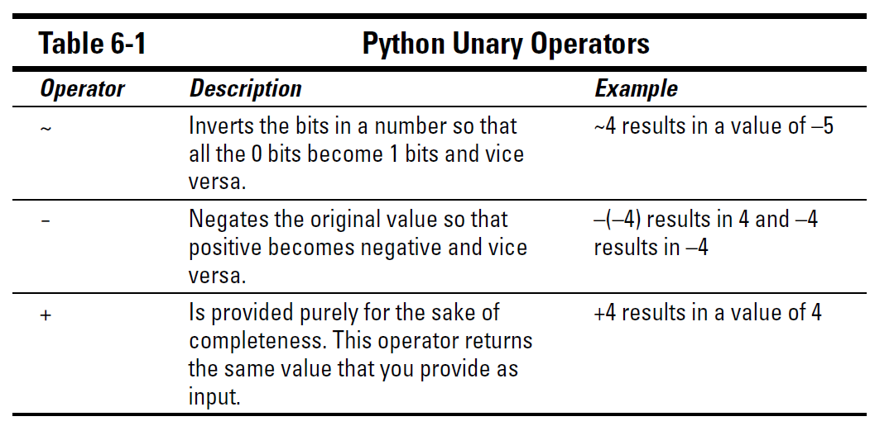

Arithmetic
~~~~~~~~~~~~~~

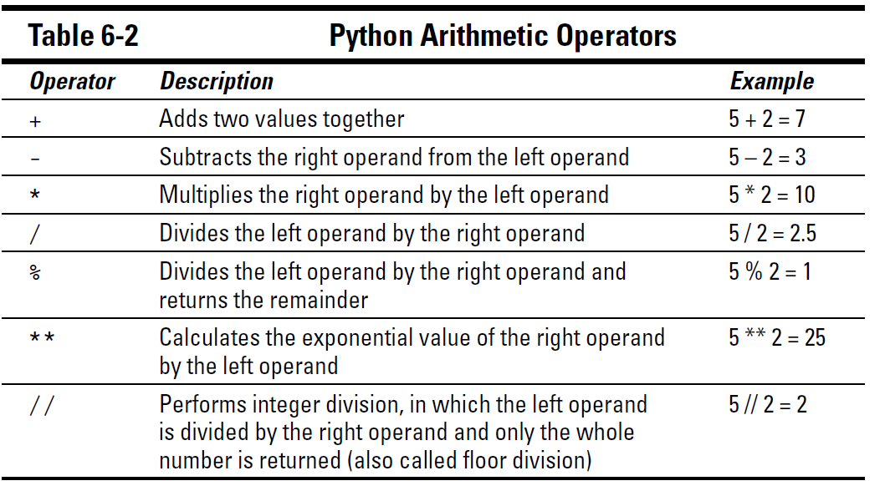

Relational
~~~~~~~~~~~~~~

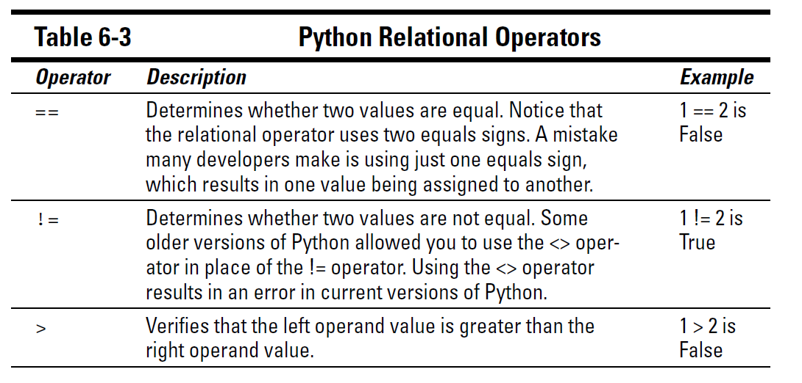
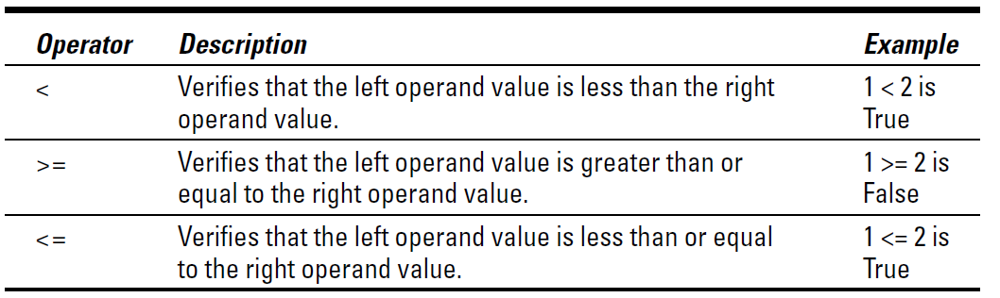

Logical
~~~~~~~~~~~~~~

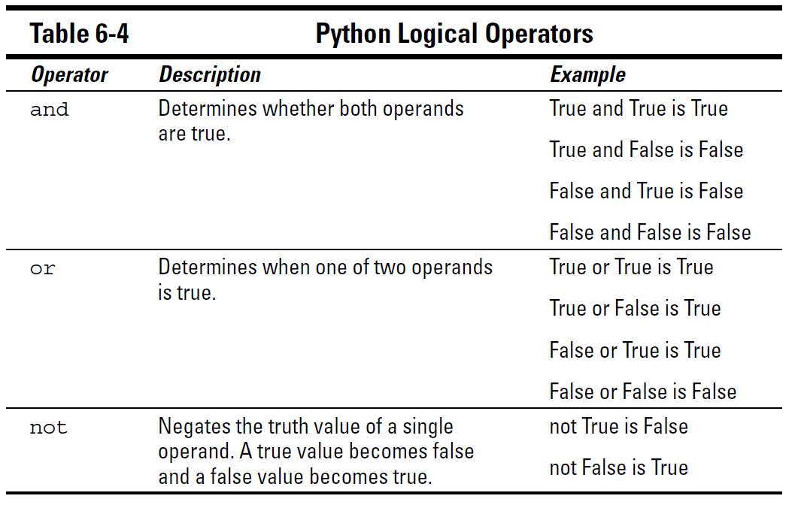

Bitwise
~~~~~~~~~~~~~~

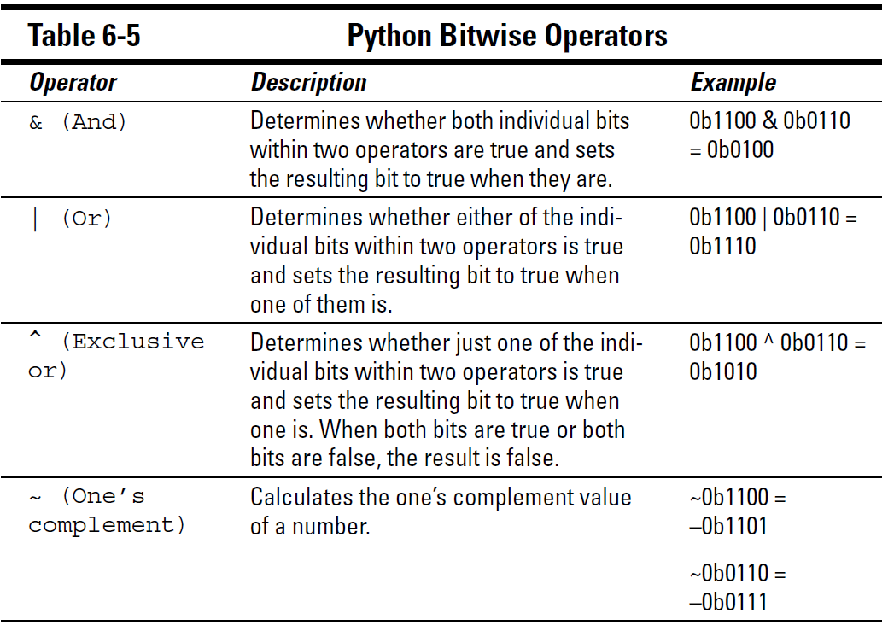
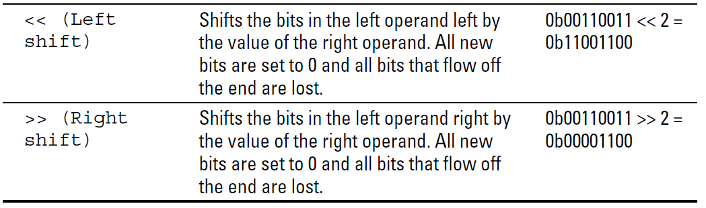

Assignment
~~~~~~~~~~~~~~
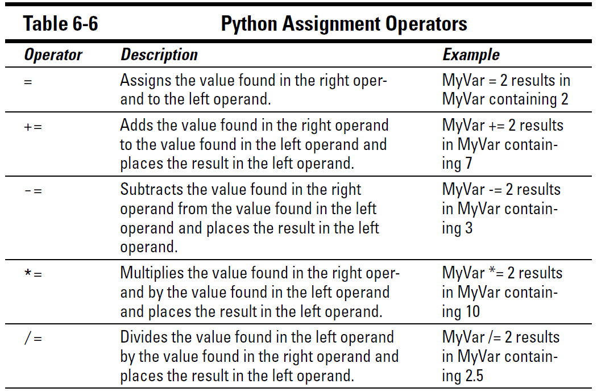
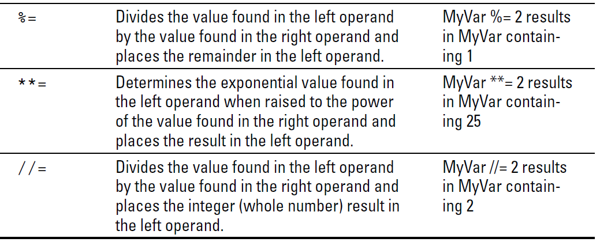

Membership
~~~~~~~~~~~~~~

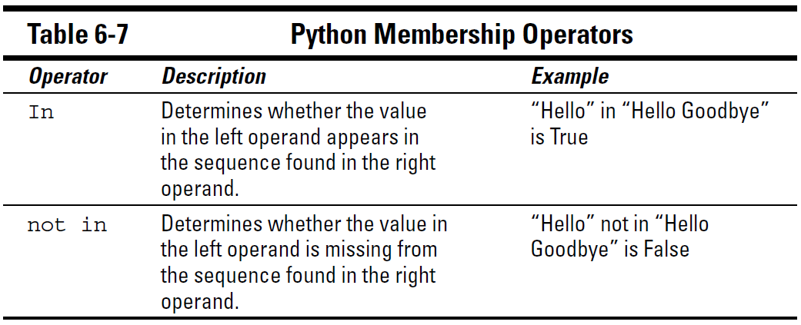

Identity
~~~~~~~~~~~~~~

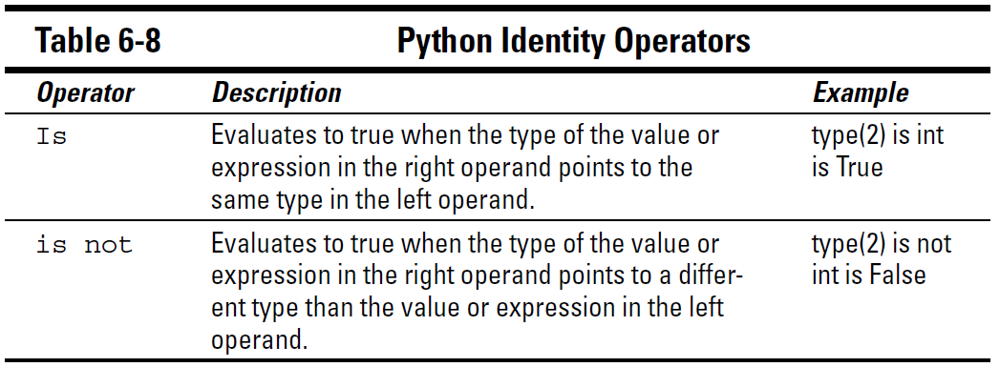

Understanding operator precedence
~~~~~~~~~~~~~~~~~~~~~~~~~~~~~~~~~~~

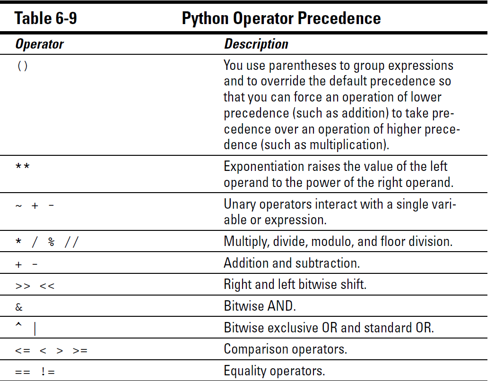
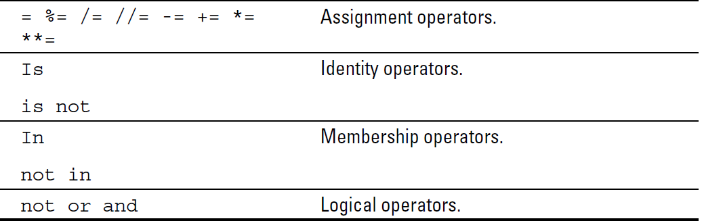

6.3 Creating and Using Functions
-----------------------------------

Defining a Function
~~~~~~~~~~~~~~~~~~~~~

함수를 정의해 보자.

.. code-block:: python

    def Hello():
        print("This is my first Python function!")

    Hello()

Accessing functions
~~~~~~~~~~~~~~~~~~~~~

함수 호출은 정의한 함수 그대로 호출하면 된다.

Sending information to functions
~~~~~~~~~~~~~~~~~~~~~~~~~~~~~~~~~~~~~~~

다음을 출력해 보자.
함수라는것은 반복적인 구문이나 어떤 상황을 전달했을때 다양하게 출력할 수 있는 것을 만드는 것이다.

.. code-block:: python

    def Hello2( Greeting ):
       print(Greeting)

    Hello2("This is the second function.")
    Hello2("It takes an argument.")

아래 예제는 값이 지정되어 전달되거나 임의로 전달되었을때 합을 출력하는 함수이다.

.. code-block:: python

    def AddIt(Value1, Value2):
        print(Value1, " + ", Value2, " = ", (Value1 + Value2))

    AddIt(2, 3)
    AddIt(Value2 = 3, Value1 = 2)

아래 예제는 기본값이 주어지지 않았을경우 출력하는 예제이다.

.. code-block:: python

    def Hello3(Greeting = "No Value Supplied"):
        print(Greeting)

    Hello3()
    Hello3("This is a string.")
    Hello3(5)
    Hello3(2 + 7)

Returning information from functions
~~~~~~~~~~~~~~~~~~~~~~~~~~~~~~~~~~~~~~~

함수로부터의 리턴값은 다양하게 나타낼수 있다 .

.. sourcecode:: pycon

    ✓ Values: Any value is acceptable. You can return numbers, such as 1 or 2.5;
    strings, such as “Hello There!”; or Boolean values, such as True or False.
    ✓ Variables: The content of any variable works just as well as a direct
    value. The caller receives whatever data is stored in the variable.
    ✓ Expressions: Many developers use expressions as a shortcut. For example,
    you can simply return A + B rather than perform the calculation,
    place the result in a variable, and then return the variable to the caller.
    Using the expression is faster and accomplishes the same task.
    ✓ Results from other functions: You can actually return data from another
    function as part of the return of your function.

함수의 리턴값을 비교하는 예제를 실행해 보자.

.. code-block:: python

    def DoAdd(Value1, Value2):
       return Value1 + Value2

    print("The sum of 3 + 4 is ", DoAdd(3, 4))
    print("3 + 4 equals 2 + 5 is ", (DoAdd(3, 4) == DoAdd(2, 5)))

6.4 Getting User Input
---------------------------

사용자가 입력을 할 수 있는 것을 제공하는 기능이다.
사용자가 입력한값을 가지고 처리하게 되는것이다.

다음 예제를 출력해 보자.

.. code-block:: python

    Name = input("Tell me your name: ")
    print("Hello ", Name)

.. code-block:: python

    ANumber = float(input("Type a number: "))
    print("You typed: ", ANumber)

Algorithms Train
--------------------------------------------

01-01.Arguments01.py
~~~~~~~~~~~~~~~~~~~~~~~~~~~~~~~~~~~~~~~~~~~~~

01-02.Arguments02.py
~~~~~~~~~~~~~~~~~~~~~~~~~~~~~~~~~~~~~~~~~~~~~

01-03.Arguments03.py
~~~~~~~~~~~~~~~~~~~~~~~~~~~~~~~~~~~~~~~~~~~~~

01-04.FirstFunction.py
~~~~~~~~~~~~~~~~~~~~~~~~~~~~~~~~~~~~~~~~~~~~~

01-05.Input01.py
~~~~~~~~~~~~~~~~~~~~~~~~~~~~~~~~~~~~~~~~~~~~~

01-06.Input02.py
~~~~~~~~~~~~~~~~~~~~~~~~~~~~~~~~~~~~~~~~~~~~~

01-07.ReturnValue.py
~~~~~~~~~~~~~~~~~~~~~~~~~~~~~~~~~~~~~~~~~~~~~

01-08.VarArgs.py
~~~~~~~~~~~~~~~~~~~~~~~~~~~~~~~~~~~~~~~~~~~~~

01.myfunction.py
~~~~~~~~~~~~~~~~~~~~~~~~~~~~~~~~~~~~~~~~~~~~~

02.basic_string.py
~~~~~~~~~~~~~~~~~~~~~~~~~~~~~~~~~~~~~~~~~~~~~

03.indexing_slicing.py
~~~~~~~~~~~~~~~~~~~~~~~~~~~~~~~~~~~~~~~~~~~~~

04.input_from_user.py
~~~~~~~~~~~~~~~~~~~~~~~~~~~~~~~~~~~~~~~~~~~~~

05.print_formating_with_string.py
~~~~~~~~~~~~~~~~~~~~~~~~~~~~~~~~~~~~~~~~~~~~~

06.properties_and_method_of_string.py
~~~~~~~~~~~~~~~~~~~~~~~~~~~~~~~~~~~~~~~~~~~~~

07.argsANDkargs.py
~~~~~~~~~~~~~~~~~~~~~~~~~~~~~~~~~~~~~~~~~~~~~

08.replace_all_occurrence.py
~~~~~~~~~~~~~~~~~~~~~~~~~~~~~~~~~~~~~~~~~~~~~

09.evil_autocorrect_prank.py
~~~~~~~~~~~~~~~~~~~~~~~~~~~~~~~~~~~~~~~~~~~~~

10.find_added.py
~~~~~~~~~~~~~~~~~~~~~~~~~~~~~~~~~~~~~~~~~~~~~

11.find_the_missing_letter.py
~~~~~~~~~~~~~~~~~~~~~~~~~~~~~~~~~~~~~~~~~~~~~

12.find_the_parity_outlier.py
~~~~~~~~~~~~~~~~~~~~~~~~~~~~~~~~~~~~~~~~~~~~~

13.fizz_slash_buzz.py
~~~~~~~~~~~~~~~~~~~~~~~~~~~~~~~~~~~~~~~~~~~~~

14.format_a_string_of_names_like_bart_lisa_and_maggie.py
~~~~~~~~~~~~~~~~~~~~~~~~~~~~~~~~~~~~~~~~~~~~~

15.nestedstatementAndScope.py
~~~~~~~~~~~~~~~~~~~~~~~~~~~~~~~~~~~~~~~~~~~~~

16.pig_latin.py
~~~~~~~~~~~~~~~~~~~~~~~~~~~~~~~~~~~~~~~~~~~~~

firstDuplicate.py
~~~~~~~~~~~~~~~~~~~~~~~~~~~~~~~~~~~~~~~~~~~~~

firstNotRepeatingCharacter.py
~~~~~~~~~~~~~~~~~~~~~~~~~~~~~~~~~~~~~~~~~~~~~

solver.py
~~~~~~~~~~~~~~~~~~~~~~~~~~~~~~~~~~~~~~~~~~~~~

solver.py
~~~~~~~~~~~~~~~~~~~~~~~~~~~~~~~~~~~~~~~~~~~~~

