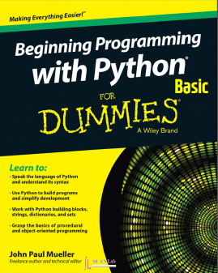

Python Basic
====================

    Python Basic

      written by sean base on following books

.. image:: ./img/chapter0_4.png

`Github <https://github.com/newsteinking/HIGH_pythondocbasic>`_ | https://github.com/newsteinking/HIGH_pythondocbasic

.. toctree::
   :maxdepth: 3

   01-preface
   02-introduction
   03-anatomy
   04-code-vectorization
   05-problem-vectorization
   06-custom-vectorization
   07-beyond-numpy
   08-conclusion
   09-quick-reference
   10-bibliography

